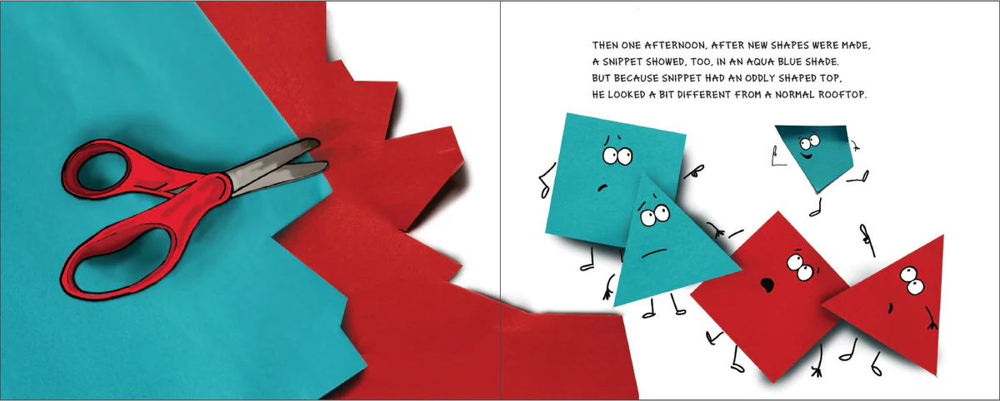

# Useful snippets and links

### Next js with styled-components
```bash
npx create-next-app --typescript --example with-styled-components my-app
```

<hr>

### Next js with sass and open-props
```bash
npx create-next-app --typescript my-app
cd my-app
npm install -D open-props sass
```

<hr>

### How to detect click outside React component ?

[source](https://www.geeksforgeeks.org/how-to-detect-click-outside-react-component/)
